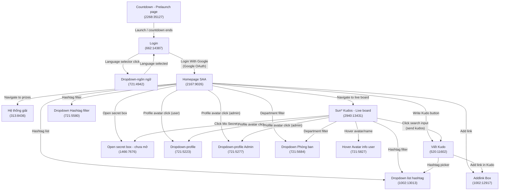
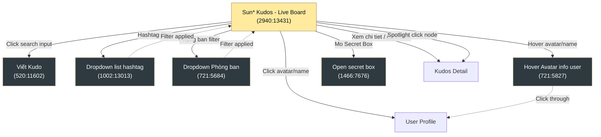

# Screen Flow — Sun* Kudos (SAA)

Figma file key: `9ypp4enmFmdK3YAFJLIu6C`

---

## All Screens / Frames

| Frame ID   | Name                          | Status |
|------------|-------------------------------|--------|
| 2268:35127 | Countdown - Prelaunch page    | spec   |
| 662:14387  | Login                         | spec   |
| 721:4942   | Dropdown-ngôn ngữ             | spec   |
| 2167:9026  | Homepage SAA                  | spec   |
| 313:8436   | Hệ thống giải                 | spec   |
| 2940:13431 | Sun* Kudos - Live board       | spec   |
| 520:11602  | Viết Kudo                     | spec   |
| 1466:7676  | Open secret box - chưa mở    | spec   |
| 1002:12917 | Addlink Box                   | spec   |
| 721:5223   | Dropdown-profile              | spec   |
| 721:5277   | Dropdown-profile Admin        | spec   |
| 721:5580   | Dropdown Hashtag filter       | spec   |
| 1002:13013 | Dropdown list hashtag         | spec   |
| 721:5684   | Dropdown Phòng ban            | spec   |
| 721:5827   | Hover Avatar info user        | spec   |

---

## Navigation Flow Diagram



---

## Screen Descriptions

### Pre-authentication

| Screen | Frame ID | Description |
|--------|----------|-------------|
| Countdown - Prelaunch page | 2268:35127 | Shown before the application officially launches; displays a countdown timer. |
| Login | 662:14387 | Entry point for authenticated users. Provides Google OAuth login and a language selector. |
| Dropdown-ngôn ngữ | 721:4942 | Overlay/dropdown triggered from the Login screen to switch the UI language. |

### Post-authentication — Main Screens

| Screen | Frame ID | Description |
|--------|----------|-------------|
| Homepage SAA | 2167:9026 | Main dashboard after successful login. Hub for all application features. |
| Hệ thống giải | 313:8436 | Prizes / reward system screen. |
| Sun* Kudos - Live board | 2940:13431 | Main kudos page: hero banner, highlight carousel (top 5), spotlight board (word cloud), all kudos feed (infinite scroll), right sidebar (stats, secret box, leaderboard). |
| Viết Kudo | 520:11602 | Form/flow to write and send a new Kudo to a colleague. |
| Open secret box - chưa mở | 1466:7676 | Secret box interaction screen (unopened state). |

### Overlay / Dropdown Components

| Screen | Frame ID | Description |
|--------|----------|-------------|
| Addlink Box | 1002:12917 | Modal/overlay for adding an external link to a Kudo. |
| Dropdown-profile | 721:5223 | Profile menu dropdown for regular users. |
| Dropdown-profile Admin | 721:5277 | Profile menu dropdown with additional admin options. |
| Dropdown Hashtag filter | 721:5580 | Dropdown for filtering the feed by hashtag. |
| Dropdown list hashtag | 1002:13013 | Full hashtag list picker used when composing a Kudo. |
| Dropdown Phòng ban | 721:5684 | Department (phòng ban) filter dropdown. |
| Hover Avatar info user | 721:5827 | Profile preview popup shown on avatar/name hover. |

---

## Key User Journeys

### 1. First-time / Returning Login
```
Countdown - Prelaunch page
  → Login
    → (language change) Dropdown-ngôn ngữ → back to Login
    → Login With Google → Google OAuth → Homepage SAA
```

### 2. Write a Kudo
```
Homepage SAA → Viết Kudo
  → (optional) Addlink Box
  → (optional) Dropdown list hashtag
  → Submit → Homepage SAA
```

### 3. Explore Kudos Feed
```
Homepage SAA
  → Dropdown Hashtag filter → (filter applied) Homepage SAA
  → Dropdown Phòng ban → (filter applied) Homepage SAA
  → Sun* Kudos - Live board
```

### 4. Profile / Account Actions
```
Homepage SAA → Dropdown-profile (user)
Homepage SAA → Dropdown-profile Admin (admin)
```

### 5. Rewards & Boxes
```
Homepage SAA → Hệ thống giải
Homepage SAA → Open secret box - chưa mở
```

### 6. Sun* Kudos - Live Board Interactions
```
Sun* Kudos - Live board
  → Click search input → Viết Kudo (send kudos dialog)
  → Hashtag filter button → Dropdown list hashtag → (filter applied) Live board
  → Phòng ban filter button → Dropdown Phòng ban → (filter applied) Live board
  → Click hashtag badge on card → (filter both Highlight & All Kudos)
  → Hover avatar/name → Hover Avatar info user (preview popup)
  → Click avatar/name → User profile
  → Click "Mo Secret Box" → Open secret box - chưa mở
  → Click "Xem chi tiet" / card → Kudos detail page
  → Click "Copy Link" → Clipboard + toast (in-page)
  → Heart toggle → Update heart count (in-page)
  → Carousel arrows → Navigate highlight cards (in-page)
  → Spotlight hover → Tooltip (in-page)
  → Spotlight click node → Kudos detail page
  → Spotlight pan/zoom → Canvas interaction (in-page)
```

---

## Sun* Kudos - Live Board — Detailed Screen Flow

### Screen Layout Breakdown

| Section | Description |
|---------|-------------|
| Navbar | Sticky top bar: logo, nav links (About SAA, Award Info, Sun* Kudos), bell, language, avatar |
| Hero Banner | Full-width: title, KUDOS logo, pill search input ("Hom nay, ban muon gui loi cam on...") |
| Highlight Kudos | Section header + Hashtag/Phong ban filters + carousel of top 5 kudos cards + pagination |
| Spotlight Board | Interactive word cloud with total count, pan/zoom, search |
| All Kudos Feed | Infinite scroll list of kudos post cards (left) + right sidebar (stats, secret box, leaderboard) |
| Footer | Site links and copyright |

### Interaction Map

| # | Element | Action | Target | Linked Frame |
|---|---------|--------|--------|-------------|
| 1 | Search input (hero) | Click | Open send-kudos dialog | 520:11602 (Viết Kudo) |
| 2 | Hashtag filter button | Click | Open hashtag dropdown | 1002:13013 (Dropdown list hashtag) |
| 3 | Phòng ban filter button | Click | Open department dropdown | 721:5684 (Dropdown Phòng ban) |
| 4 | Hashtag badge (on card) | Click | Filter both Highlight & All Kudos | In-page filter |
| 5 | Avatar / Username | Hover | Show profile preview | 721:5827 (Hover Avatar info user) |
| 6 | Avatar / Username | Click | Navigate to profile | User profile page |
| 7 | Star badges | Hover | Show tooltip (1★=10, 2★=20, 3★=50) | In-page tooltip |
| 8 | Heart icon | Click | Toggle like (+1 or +2 pts on special day) | In-page state toggle |
| 9 | "Copy Link" button | Click | Copy URL to clipboard + toast | In-page action |
| 10 | "Xem chi tiet" link | Click | Navigate to kudos detail | Kudos detail page |
| 11 | Highlight card | Click | Navigate to kudos detail | Kudos detail page |
| 12 | Carousel arrows | Click | Navigate carousel (prev/next) | In-page carousel |
| 13 | Pagination arrows | Click | Navigate carousel pages | In-page carousel |
| 14 | "Mo Secret Box" button | Click | Open secret box dialog | 1466:7676 (Open secret box) |
| 15 | Spotlight name node | Hover | Show tooltip (name + time) | In-page tooltip |
| 16 | Spotlight name node | Click | Navigate to kudos detail | Kudos detail page |
| 17 | Spotlight pan/zoom | Click/drag | Pan and zoom visualization | In-page canvas |
| 18 | Spotlight search | Type + Enter | Highlight matching names | In-page filter |
| 19 | Image thumbnail | Click | Open full-size image | In-page modal |
| 20 | Leaderboard avatar/name | Click | Navigate to user profile | User profile page |

### Live Board Navigation Flowchart


