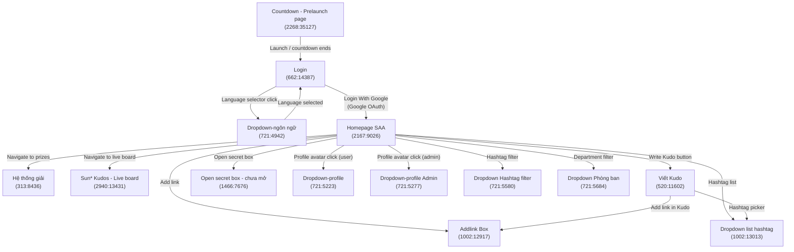

# Screen Flow — Sun* Kudos (SAA)

Figma file key: `9ypp4enmFmdK3YAFJLIu6C`

---

## All Screens / Frames

| Frame ID   | Name                          | Status |
|------------|-------------------------------|--------|
| 2268:35127 | Countdown - Prelaunch page    | spec   |
| 662:14387  | Login                         | spec   |
| 721:4942   | Dropdown-ngôn ngữ             | spec   |
| 2167:9026  | Homepage SAA                  | spec   |
| 313:8436   | Hệ thống giải                 | spec   |
| 2940:13431 | Sun* Kudos - Live board       | spec   |
| 520:11602  | Viết Kudo                     | spec   |
| 1466:7676  | Open secret box - chưa mở    | spec   |
| 1002:12917 | Addlink Box                   | spec   |
| 721:5223   | Dropdown-profile              | spec   |
| 721:5277   | Dropdown-profile Admin        | spec   |
| 721:5580   | Dropdown Hashtag filter       | spec   |
| 1002:13013 | Dropdown list hashtag         | spec   |
| 721:5684   | Dropdown Phòng ban            | spec   |

---

## Navigation Flow Diagram



---

## Screen Descriptions

### Pre-authentication

| Screen | Frame ID | Description |
|--------|----------|-------------|
| Countdown - Prelaunch page | 2268:35127 | Shown before the application officially launches; displays a countdown timer. |
| Login | 662:14387 | Entry point for authenticated users. Provides Google OAuth login and a language selector. |
| Dropdown-ngôn ngữ | 721:4942 | Overlay/dropdown triggered from the Login screen to switch the UI language. |

### Post-authentication — Main Screens

| Screen | Frame ID | Description |
|--------|----------|-------------|
| Homepage SAA | 2167:9026 | Main dashboard after successful login. Hub for all application features. |
| Hệ thống giải | 313:8436 | Prizes / reward system screen. |
| Sun* Kudos - Live board | 2940:13431 | Real-time live board displaying kudos activity. |
| Viết Kudo | 520:11602 | Form/flow to write and send a new Kudo to a colleague. |
| Open secret box - chưa mở | 1466:7676 | Secret box interaction screen (unopened state). |

### Overlay / Dropdown Components

| Screen | Frame ID | Description |
|--------|----------|-------------|
| Addlink Box | 1002:12917 | Modal/overlay for adding an external link to a Kudo. |
| Dropdown-profile | 721:5223 | Profile menu dropdown for regular users. |
| Dropdown-profile Admin | 721:5277 | Profile menu dropdown with additional admin options. |
| Dropdown Hashtag filter | 721:5580 | Dropdown for filtering the feed by hashtag. |
| Dropdown list hashtag | 1002:13013 | Full hashtag list picker used when composing a Kudo. |
| Dropdown Phòng ban | 721:5684 | Department (phòng ban) filter dropdown. |

---

## Key User Journeys

### 1. First-time / Returning Login
```
Countdown - Prelaunch page
  → Login
    → (language change) Dropdown-ngôn ngữ → back to Login
    → Login With Google → Google OAuth → Homepage SAA
```

### 2. Write a Kudo
```
Homepage SAA → Viết Kudo
  → (optional) Addlink Box
  → (optional) Dropdown list hashtag
  → Submit → Homepage SAA
```

### 3. Explore Kudos Feed
```
Homepage SAA
  → Dropdown Hashtag filter → (filter applied) Homepage SAA
  → Dropdown Phòng ban → (filter applied) Homepage SAA
  → Sun* Kudos - Live board
```

### 4. Profile / Account Actions
```
Homepage SAA → Dropdown-profile (user)
Homepage SAA → Dropdown-profile Admin (admin)
```

### 5. Rewards & Boxes
```
Homepage SAA → Hệ thống giải
Homepage SAA → Open secret box - chưa mở
```
